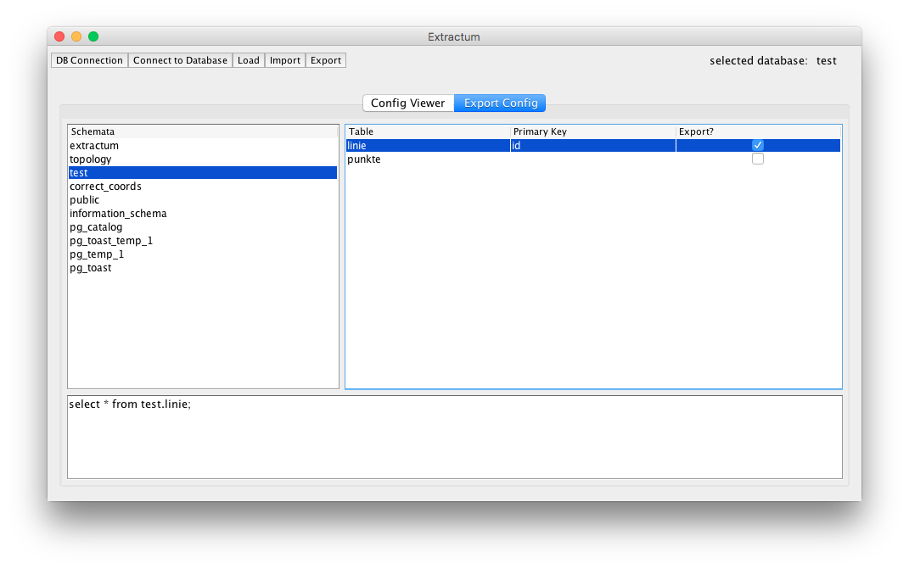

# Extractum
Automatic import into and export of multiple tables or datasets from a PostgreSQL database.

## Goal of the project
This application is a little tool to import and export multiple datasets from different tables into/from a PostgreSQL database at the same time. With this tool it is not necessary to import/export every single table/datasets one after one using e.g. QGIS or PostgreSQL-commands (e.g. pgdump/pgrestore). Another advantage of this tool is the export of table structures, e.g. primary keys and column types. This configuration is used for the data import, i.e. all datasets, which were exported into CSV-files (text-files) will be imported into the correct column types.

## Preliminary remark
This project uses <b>Java SE 9</b> and the developement-version of Netbeans <b>NetBeans Dev 201712280002</b>. The source code runs on Java 8 and 9, it is not tested against other versions. The tool was developed under macOS and is not tested on other operating systems. If somebody runs the software under another OS, please create an issue with your experience.
 The software is available under the terms of Apache 2.0, so feel free to use (or contribute to) the project. ^^
 All documentation and the GUI are realised in english language. No further internationalisation is realised already. The software creates a LOG-file in a directory called "log" located in the same directory then the JAR-file. For each start of the software a new LOG-file will be created. The content of the current LOG-file will be displayed in the LOG-dialog (located in the Help-menu:
 ). 

## Usage and hints
The GUI has two tabs, one for displaying a config-file (and import the data after that) and one for export data.
  

### Usage of config-file
The configuration file will be created during the data export and will be used generally for the import. But it can be necessary for the export too:
 If the export tab is activated and the "Load"-button is clicked, the content of the file will be inserted into the export tab, i.e. an export can be repeated by using its configuration. Make sure that the schema and the tables are available in the current database, otherwise the export will fail. In the paragraph about the export it is decribed why this works.

### Database Connection
  
A connection to a database is mandatory for import into or exporting from it. Button 1 opens a new settings window. All parametres except the password will be stored in the registry (Windows) or in a Java-PLIST-file in ~/Library/Preferences/... (macOS). After closing the settings dialog, press "Connect to Database" (Button 2). In the dialog for inserting the database parametres you can check whether a connectio with the given parametres can be established or not. A JOptionPane will inform the user about the result:
  
The log-file and -dialog will display futher information about the current status of the database connection.

### Export
After establishing of the database connection, all available schemata of the selected database should apear in the schemata-table:
  
Clicking on any schema will query all tables of that schema and insert them into the main table of this tab. After clicking on any table the tool inserts the current SQL-SELECT-statement of this table into the corresponding JTextArea. The default query is "SELECT * FROM table". The user can edit this statements for each table to restrict the datasets, that should be exported from the database (theoretical every SQL-statement will be executed, but it is only tested with SELECT-statements on the corresponding table). After going to another schema, all tables have the initial statement "SELECT * FROM table"! The statements will be stored internally in a HashMap with table names as keys and the statements as values. The user can enable or disable the checkboxes to tell the software, which tables of this schema should be exported:
  
It is not possible to export from more than one schema at the same time.
 After a click on <b>Export</b>, the user chooses the destination of the config-file and give them a name (the file extension <i>XML</i> will <b>not</b> be added automaticly). In the same directory a new folder will be created, where each table will be stored in an own CSV-file.
 The software iterates over each entry in the main table of this tab and executes their queries stored in an internal HashMap. If the user imported a config-file into the export tab (described in the paragraph <i>Usage of config-file</i>), than the main table and the internal HashMap will be filled up with the information from the config file and just this data will be used for the export. So be aware, that the connected database corresponds to the config file. Otherwise an exception will be thrown.

### Import
After establishing a connection to a database, a mouse click on <b>Import</b> starts the import by opening a file dialog for choosing the configuration file. In the configuration file the software can find all necessary information like paths to the CSV-files. The data will be imported into a new schema named <b>extractum</b>. Before the import starts, a config file can be displayed in the tab <b>Config Viewer</b> using the button <b>Load</b>. After clicking on an entry in the table, the corresponding SQL-SELECT-statement from the export routine will be displayed in the JTextArea at the bottom of the dialog. The entries in the table are not editable. If the import-button is clicked when a config file is displayed, the currently displayed configuration will be imported without the necessity of choosing the config file again.

### XML-file
The schema and an example of the (XML-)configuration file is availlable in the following directory of the repository:
<a href="Extractum/src/xmlSchema">Extractum/src/xmlSchema</a>
The software uses JAXB for reading and writing information from/to the XML structure. The JAXB-object structure is availlable in the package <b>extractumXml</b>. Information about all exported tables with their columns and column types, primary keys and the SQL-queries are stored within the XML file.

### CSV-files
The CSV-files are semicolon separeted and contain a heading line representing the names of the columns. Each dataset retrieved from the query is stored in a single row in the file.
